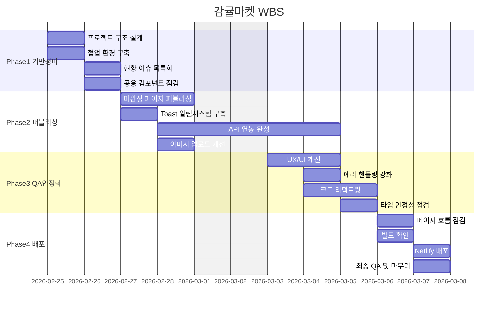

# 감귤마켓 🍊
**SNS 기반 상품 홍보 플랫폼**

감귤마켓은 사용자 간 소통과 상품 홍보 기능을 결합한 SNS 기반 서비스입니다.  
사용자는 게시글을 작성하여 자신의 일상을 공유할 수 있으며, 다른 사용자를 팔로우하여 홈 피드에서 게시글을 확인할 수 있습니다.  
개인 스토어에서 상품을 등록해 홍보하거나, 좋아요·댓글·채팅으로 소통할 수 있습니다.  
본 프로젝트는 **React + TypeScript** 기반 SPA 구조로 구현되었습니다.

---

## 🔗 배포 링크

[https://gamgyul-market.netlify.app](https://gamgyul-market.netlify.app)

---

## 🧪 테스트 계정

| ID | PW |
|----|----|
| test35@test.com | 20260305 |

---

## 👨‍👩‍👧‍👦 팀원 소개 및 역할

### 팀 구성

| | 팀장 | 팀원 | 팀원 | 팀원 | 팀원 |
|:---:|:---:|:---:|:---:|:---:|:---:|
| **프로필** |  |  |  |  |  |
| **이름** | 팀원 1 | 팀원 2 | 팀원 3 | 팀원 4 | 팀원 5 |
| **GitHub** | [@팀원1](https://github.com) | [@팀원2](https://github.com) | [@팀원3](https://github.com) | [@팀원4](https://github.com) | [@팀원5](https://github.com) |

### 역할 분담

| 담당자 | 페이지 | 주요 기능 | Route | CRUD |
|:------:|--------|-----------|-------|:----:|
| 팀원 1 | Login · 404 | 로그인 메인 · 이메일 로그인 화면 전환 · 입력값 충족 시 버튼 활성/비활성 · 로그인 실패 경고 문구 · focus 시 underline 색 변경 · 404 페이지 · 회원가입 페이지 에러메시지 위치 수정 | `/login` `/404` | - |
| 팀원 2 | Home Feed | 팔로우 없을 때 빈 화면(검색하기 버튼) · 피드 목록 UI · 검색 아이콘 이동 · 게시글 카드 공통 UI | `/home` | Read |
| 팀원 3 | Upload (작성/수정) | 글 입력 또는 사진 업로드 시 버튼 활성 · 기본 1장(최대 3장) · Create/Update 동일 컴포넌트 재사용(prefill) | `/post/upload` `/post/:id/edit` | Create / Update |
| 팀원 4 | Post Detail | 게시글 상세 화면 · 우측 상단 모달(삭제/수정/신고) · 삭제/신고 확인 모달 · 좋아요 토글 UI | `/post/:id` | Read / Delete |
| 팀원 5 | Join · Chat | **Join** : 이메일/비번 blur 시 즉시 검증 · 2단계 폼(step) · 프로필 설정(사진/이름/계정ID/소개) · 계정ID 형식/중복 검증 · 저장 버튼 활성 조건 **/** **Chat** : 채팅 목록 · 채팅방 UI · Firebase Firestore 실시간 메시지 동기화(`onSnapshot`) | `/join` (step 1/2) `/chat` `/chat/:id` | Create / Read |

---

## 🚀 주요 기능

### 🔐 회원가입 / 로그인
- 이메일 기반 회원가입 및 로그인
- 로그인 실패 시 Toast 알림으로 에러 메시지 표시
- ProtectedRoute를 통한 인증 상태 보호

### 🏠 홈 피드
- 팔로우한 사용자의 게시글을 홈 피드에서 확인
- 팔로우 중인 사용자가 없을 경우 빈 상태(Empty State) UI 제공

### 📝 게시글
- 게시글 작성 및 이미지 업로드 (최대 3장)
- 게시글 좋아요 및 댓글 기능

### 👤 프로필
- 사용자 프로필 조회 (목록형 / 앨범형 전환)
- 팔로우 / 언팔로우 및 팔로워·팔로잉 목록 조회

### 🛒 상품 등록
- 개인 스토어 상품 등록 / 수정 / 삭제

### 💬 채팅
- Firebase Firestore 기반 실시간 1:1 채팅
- `onSnapshot`을 활용한 실시간 메시지 동기화
- 채팅 알림 기능

---

## 🖥 서비스 화면

| 로그인 | 회원가입 |
|:------:|:--------:|
|  |  |

| 홈 피드 | 게시글 작성 |
|:-------:|:-----------:|
|  |  |

| 프로필 | 채팅 |
|:------:|:----:|
|  |  |

> `docs/` 폴더에 캡처 이미지를 추가한 후 경로를 수정해주세요.
---

## 구현 범위

###  필수 구현

- Splash, 로그인/회원가입, 프로필 설정
- 홈 피드 (팔로우 게시글, 빈 화면)
- 사용자 프로필 (팔로우 토글, 목록형/앨범형)
- 게시글 작성/상세/댓글
- 상품 등록/수정/삭제
- 바텀시트 + 확인 모달
- 하단 탭바, 404 페이지, 보호 라우트

###  마크업만 (서버 기능 없음)

- SNS 로그인 버튼 (UI만)

---

## 🛠 기술 스택

- React 18 + TypeScript 5 + TailwindCSS 3 + Vite 5
- react-router-dom v6
- Fetch API 기반 커스텀 API 클라이언트
- Firebase Firestore + Anonymous Auth (1:1 실시간 채팅)
- Netlify 배포

---

## 📌 기술 선택 이유

### Firebase Firestore — 실시간 채팅
기존 백엔드 API는 실시간 통신을 지원하지 않아 별도 인프라가 필요했습니다.  
WebSocket 직접 구현은 별도 서버가 필요했고, Supabase는 레퍼런스가 부족했습니다.  
Firestore는 `onSnapshot`으로 서버 없이 실시간 구독이 가능하고, 기존 REST API와 독립적으로 추가할 수 있어 선택했습니다.

### Firebase Anonymous Auth
Firebase Rules 적용을 위해 Firebase 자체 인증이 필요했습니다.  
MVP 단계에서 Custom Token 방식은 서버 작업이 수반되어 복잡도가 높아, Anonymous Auth를 채택해 기능 검증을 우선했습니다.  
추후 운영 전환 시 `auth.ts` 한 곳만 수정하면 Custom Token 방식으로 교체할 수 있도록 분리해두었습니다.

### 상태관리 라이브러리 미사용
전역 상태의 복잡도가 높지 않아 Redux · Zustand 같은 별도 라이브러리를 도입하지 않았습니다.  
React Context API와 localStorage를 조합해 인증 상태를 관리했으며, 불필요한 의존성을 줄이고 팀 학습 비용을 낮추는 것이 생산성에 더 유리하다고 판단했습니다.

자세한 내용은 [GitHub Wiki](../../wiki)를 참고하세요.

---

## 📦 폴더 구조

Feature 기반 구조를 사용하여 기능 단위로 코드를 분리했습니다.
```
src/
├── app/
│   ├── layouts/        # AppLayout, TopBar, ProtectedRoute
│   ├── providers/      # AuthProvider (Context + localStorage)
│   ├── router/         # react-router-dom v6 라우터
│   └── styles/         # Tailwind base CSS
├── features/
│   ├── login/          # 로그인 메인, 이메일 로그인
│   ├── join/           # 이메일 회원가입, 프로필 설정
│   ├── home/           # 홈 피드
│   ├── profile/        # 프로필, 팔로워/팔로잉, 프로필 수정
│   ├── product/        # 상품 등록/수정
│   ├── upload/         # 게시글 작성
│   ├── post/           # 게시글 상세, 댓글
│   ├── search/         # 사용자 검색
│   └── chat/           # 채팅 (Firebase 실시간 채팅)
├── shared/
│   ├── api/            # fetch 기반 API 클라이언트
│   ├── components/     # Button, Input, Modal, BottomSheet, TabBar 등
│   ├── constants/      # 라우트, 정규식, 스토리지 키
│   ├── hooks/          # useDebounce
│   ├── types/          # User, Post, Comment, Product 타입
│   └── utils/          # formatPrice, validateEmail 등
└── pages/
    ├── SplashPage      # 스플래시
    └── NotFoundPage    # 404
```
---
## 🧑‍💻 개발 규칙

### 파일 확장자 규칙 (.ts vs .tsx)

TypeScript는 JSX 문법이 있는 파일만 `.tsx`로 작성합니다.

| 확장자 | 사용 기준 | 예시 |
|:------:|-----------|------|
| `.ts`  | JSX 없음 — API 함수, 유틸, 타입 정의, 훅(반환값이 JSX가 아닌 경우) | `client.ts`, `useDebounce.ts`, `validateEmail.ts` |
| `.tsx` | `return <JSX />` 가 있는 컴포넌트 | `PostWritePage.tsx`, `Button.tsx` |

> 훅(hook)은 JSX를 반환하지 않으면 `.ts`로 작성합니다.
---

## 🧩 트러블슈팅

### 1. 로그인 에러 처리 개선

**문제**  
로그인 실패 시 `console.error`로만 처리되어 사용자가 오류 상황을 인지하기 어려웠습니다.

**해결**  
Toast 알림 컴포넌트를 도입하여 사용자에게 직접 에러 메시지를 표시하도록 개선했습니다.
```ts
// Before
} catch (error) {
  console.error(error)
}

// After
} catch (error) {
  toast.error('로그인에 실패했습니다. 이메일과 비밀번호를 확인해주세요.')
}
```

### 2. 이미지 업로드 메모리 누수 수정

**문제**  
`URL.createObjectURL`로 생성한 미리보기 URL을 해제하지 않아 메모리 누수가 발생했습니다.

**해결**  
`useEffect` cleanup에서 `URL.revokeObjectURL`을 호출해 메모리를 해제했습니다.
```ts
useEffect(() => {
  if (!file) return
  const url = URL.createObjectURL(file)
  setPreview(url)
  return () => URL.revokeObjectURL(url) // cleanup
}, [file])
```

> 각 팀원의 트러블슈팅을 아래 형식으로 추가해주세요.

### 3. [팀원 작성 예정]

**문제**

**해결**
```ts
// 핵심 코드 스니펫
```

---

## 📅 WBS (개발 일정)

> **기간**: 2026.02.25 (수) ~ 2026.03.07 (토) · 총 11일  
> **근무일**: 월~토 / 일요일 휴무 / 공휴일 제외  
> **휴무**: 3/1 일요일, 3/2 삼일절 대체공휴일


### Phase 1. 기반 정비 `2/25 (수) ~ 2/26 (목)`

| No. | 작업 항목 | 세부 내용 | 기간 |
|-----|-----------|-----------|:----:|
| 1.1 | 프로젝트 구조 설계 확정 | Feature-based 구조 최종 확인, 폴더 규칙 정리, import alias 통일 | 2/25 |
| 1.2 | 협업 환경 구축 | 브랜치 전략 재확인, PR 템플릿, 코드 리뷰 기준 문서화 | 2/25 |
| 1.3 | 현황 이슈 목록화 | `home/api/index.ts` 코드 혼재, `getTestToken()` 방치, `BASE_URL` 하드코딩 등 이슈 정리 | 2/26 |
| 1.4 | 공용 컴포넌트 분기 점검 | `shared/components` vs `features/*/components` 역할 분리 기준 정립, 중복 컴포넌트(`PostCard`) 통합 여부 결정 | 2/26 |

### Phase 2. 퍼블리싱 & API 연동 `2/27 (금) ~ 3/3 (화)`

> 3/1 (일) 일요일 휴무, 3/2 (월) 삼일절 대체공휴일 제외

| No. | 작업 항목 | 세부 내용 | 기간 |
|-----|-----------|-----------|:----:|
| 2.1 | 미완성 페이지 퍼블리싱 | 채팅 목록/채팅방 UI 완성, 빈 상태(Empty State) UI 추가, 스켈레톤/로딩 UI 개선 | 2/27 ~ 2/28 |
| 2.2 | Toast/알림 시스템 구축 | `console.error` 대신 사용자에게 보이는 Toast 컴포넌트 추가 (에러/성공 피드백) | 2/27 |
| 2.3 | API 연동 완성 | Mock 데이터인 채팅 API 연동 검토, 미연동 엔드포인트 확인 및 연결 | 2/28 ~ 3/3 |
| 2.4 | 이미지 업로드 개선 | `URL.createObjectURL` 메모리 누수 수정 (cleanup 추가), 업로드 실패 피드백 추가 | 2/28 |

### Phase 3. QA 및 안정화 `3/3 (화) ~ 3/5 (목)`

| No. | 작업 항목 | 세부 내용 | 기간 |
|-----|-----------|-----------|:----:|
| 3.1 | UX/UI 개선 | 폼 유효성 메시지 개선, 빈 피드 안내 화면, 프로필 이미지 fallback 처리 검토 | 3/3 ~ 3/4 |
| 3.2 | 에러 핸들링 강화 | API 실패 시 사용자 피드백 일관성 확보, 401 만료 흐름 점검, 네트워크 에러 처리 | 3/4 |
| 3.3 | 코드 리팩토링 | `home/api/index.ts` 정리, `getTestToken()` 제거, `BASE_URL` constants 통일, 미사용 코드 정리 | 3/4 ~ 3/5 |
| 3.4 | 타입 안정성 점검 | TypeScript `any` 사용 부분 타입 구체화, `shared/types/index.ts` 누락 타입 추가 | 3/5 |

### Phase 4. 흐름 점검 & 배포 `3/6 (금) ~ 3/7 (토)`

| No. | 작업 항목 | 세부 내용 | 기간 |
|-----|-----------|-----------|:----:|
| 4.1 | 페이지 흐름 점검 | 로그인 → 회원가입 → 홈 → 프로필 → 게시물 전체 플로우 수동 QA, 라우트 가드 동작 확인 | 3/6 |
| 4.2 | 빌드 확인 | `vite build` TypeScript 에러 0건 확인, 번들 크기 점검, 환경변수 분리 | 3/6 |
| 4.3 | Netlify 배포 | `netlify.toml` 설정, SPA 리다이렉트 (`_redirects` 파일), 환경변수 등록, 도메인 연결 | 3/7 |
| 4.4 | 최종 QA 및 마무리 | 배포 환경에서 전체 기능 검증, 치명적 버그 핫픽스, 릴리즈 태그 | 3/7 |

---

## 🔧 실행 방법
```bash
# 의존성 설치
npm install

# 개발 서버 실행
npm run dev
# → http://localhost:5173

# 프로덕션 빌드
npm run build
```

### 환경변수 설정

`.env.example`을 복사하여 `.env` 파일을 생성하세요.
```env
VITE_API_BASE_URL=https://dev.wenivops.co.kr/services/mandarin

VITE_FIREBASE_API_KEY=
VITE_FIREBASE_AUTH_DOMAIN=
VITE_FIREBASE_PROJECT_ID=
VITE_FIREBASE_STORAGE_BUCKET=
VITE_FIREBASE_MESSAGING_SENDER_ID=
VITE_FIREBASE_APP_ID=
```

Firebase 설정 방법, Netlify 환경변수 등록, 보안 규칙은 [GitHub Wiki](../../wiki)를 참고하세요.

---

## 🔮 추후 개선 사항

- 카카오 · 구글 SNS 로그인 기능 연동
