#  감귤마켓 (Gamgyul Market)

> 일상을 공유하고, 상품을 홍보하고, 실시간으로 소통하는 SNS 기반 상품 홍보 플랫폼

<br>

---

##  목차

1. [프로젝트 소개](#-프로젝트-소개)
2. [팀원 소개 및 역할](#-팀원-소개-및-역할)
3. [협업 프로세스](#-협업-프로세스)
4. [개발 규칙](#-개발-규칙)
5. [개발 일정 WBS](#-개발-일정-wbs)
6. [기술 스택](#-기술-스택)
7. [아키텍처](#-아키텍처)
8. [URL 구조](#-url-구조)
9. [폴더 구조](#-폴더-구조)
10. [화면 설계](#-화면-설계)
11. [구현 범위](#-구현-범위)
12. [주요 기능](#-주요-기능)
13. [코드 품질 관리](#-코드-품질-관리)
14. [트러블슈팅](#-트러블슈팅)
15. [추후 개선 사항](#-추후-개선-사항)

<br>

---

##  프로젝트 소개

**감귤마켓**은 SNS 피드와 개인 스토어 기능을 결합한 상품 홍보 플랫폼입니다.

- 팔로우 기반 피드에서 지인의 일상과 상품 소식을 함께 확인할 수 있습니다.
- 개인 스토어에 상품을 등록하고, 좋아요 · 댓글 · 실시간 채팅으로 사용자 간 직접 소통이 가능합니다.
- **React + TypeScript** 기반 SPA로 구현되었으며, Netlify를 통해 배포되었습니다.

| 항목 | 내용 |
|------|------|
|  개발 기간 | 2026.02.24 (화) ~ 2026.03.07 (토) · 총 12일 |
|  팀 구성 | 5인 |
| 배포 URL | https://gamgyul-market.netlify.app |
|  기술 스택 | React 18 · TypeScript 5 · TailwindCSS 3 · Vite 5 · Firebase |

<br>

###  Problem

기존 SNS는 개인 일상 공유에 집중되어 있어, 소규모 판매자가 상품을 자연스럽게 홍보하기에는 한계가 있습니다.
반대로 중고거래 플랫폼은 거래 자체에 집중된 구조라, 관계 기반의 콘텐츠 소비나 사용자 간 소통이 부족합니다.

SNS의 소통 구조와 상품 홍보 기능을 하나의 플랫폼에서 제공할 필요가 있다고 판단했습니다.

###  Solution

감귤마켓은 SNS 기반 피드와 개인 스토어 기능을 결합하여 다음 세 가지를 하나의 플랫폼에서 해결합니다.

- 일상 콘텐츠 공유 (팔로우 피드)
- 상품 홍보 (개인 스토어 등록 · 수정 · 삭제)
- 사용자 간 소통 (좋아요 · 댓글 · Firebase 실시간 채팅)

특히 Firebase Firestore의 `onSnapshot`을 활용한 실시간 채팅을 통해, 별도 백엔드 서버 없이도 구매자와 판매자가 즉시 소통할 수 있는 환경을 구현했습니다.

<br>

###  테스트 계정

| ID | PW |
|----|----|
| test35@test.com | 20260305 |

<br>

###  실행 방법

```bash
# 의존성 설치
npm install

# 개발 서버 실행
npm run dev
# → http://localhost:5173

# 프로덕션 빌드
npm run build
```

`.env.example`을 복사하여 `.env` 파일을 생성하세요.

```env
VITE_API_BASE_URL=https://dev.wenivops.co.kr/services/mandarin

VITE_FIREBASE_API_KEY=
VITE_FIREBASE_AUTH_DOMAIN=
VITE_FIREBASE_PROJECT_ID=
VITE_FIREBASE_STORAGE_BUCKET=
VITE_FIREBASE_MESSAGING_SENDER_ID=
VITE_FIREBASE_APP_ID=
```

Firebase 설정 방법, Netlify 환경변수 등록, 보안 규칙은 [GitHub Wiki](../../wiki)를 참고하세요.

<br>

---

##  팀원 소개 및 역할

### 팀 구성

| | 팀장 | 팀원 | 팀원 | 팀원 | 팀원 |
|:---:|:---:|:---:|:---:|:---:|:---:|
| **프로필** |  |  |  |  |  |
| **이름** | 정준서 | 강지연 | 강명주 | 김수진 | 한태영 |
| **GitHub** | [@아이디](https://github.com) | [@tndjqtlfh](https://github.com/tndjqtlfh) | [@아이디](https://github.com) | [@아이디](https://github.com) | [@아이디](https://github.com) |

<br>

### 역할 분담

> 기능 영역 단위로 책임을 명확히 분리했으며, 각 담당자는 기획 해석 · 퍼블리싱 · API 연동 · 예외 처리까지 전담했습니다.

| 담당자 | 담당 영역 | 주요 기능 | Route | CRUD |
|:------:|-----------|-----------|-------|:----:|
| 강지연 | Login · 404 · 회의록 작성 | 로그인 메인 · 이메일 로그인 화면 전환 · 입력값 검증 · 로그인 실패 메시지 · 404 페이지 · 데일리 스크럼 기록 | `/login/*` `/404` | - |
| 강명주 | Home Feed | 팔로우 유무에 따른 피드 분기 · 피드 목록 렌더링 · 게시글 카드 컴포넌트 · 검색 페이지 이동 | `/home` | Read |
| 김수진 | Upload · Post Detail | 게시글 작성 · 이미지 업로드 (최대 3장) · Create/Update 컴포넌트 재사용 · 게시글 상세 · 좋아요 토글 · 액션 모달 | `/post/*` | Create / Read / Update / Delete |
| 정준서 | 개인 프로필 · 총괄리팩토링 · 배포 | 프로필 상세 · 팔로워/팔로잉 목록 · 목록형/앨범형 전환 · 상품 CRUD · 코드 리팩토링 · Netlify 배포 | `/profile/*` `/product/*` | Create / Read / Update / Delete |
| 한태영 | Splash · Join · Chat | 스플래시 로그인 분기 · 2단계 회원가입 폼 · 계정ID 검증 · Firebase 실시간 채팅 (`onSnapshot`) | `/` `/join/*` `/chat/*` | Create / Read |

<br>

---

##  협업 프로세스

> 협업 규칙을 GitHub Wiki에 명문화하고, Issues · Projects · Discussion을 적극 활용하여 일관된 코드 품질과 팀 커뮤니케이션을 유지했습니다.  
> → [ GitHub Wiki 전체 규칙 바로가기](../../wiki)

### 브랜치 전략

```
main          ← 배포/릴리즈 브랜치 (직접 push 금지)
└── dev       ← 통합 개발 브랜치 (기능들이 모이는 곳)
    ├── feat/#이슈번호-설명    ← 기능 개발
    ├── fix/#이슈번호-설명     ← 버그 수정
    ├── refactor/#이슈번호-설명
    └── chore/#이슈번호-설명
```

```
브랜치 예시)
feat/#123-login-toast
fix/#87-image-memory-leak
```

### 커밋 컨벤션 (Conventional Commits)

```
type(scope): subject

예시)
feat(login): add toast error message
fix(upload): revoke object url on unmount
refactor(post): split PostCard component
```

| 타입 | 설명 |
|:----:|------|
| `feat` | 기능 추가 |
| `fix` | 버그 수정 |
| `refactor` | 리팩토링 (동작 동일) |
| `style` | 포맷/공백 등 (로직 변경 없음) |
| `docs` | 문서만 변경 |
| `chore` | 빌드 · 설정 · 기타 잡일 |
| `perf` | 성능 개선 |
| `revert` | 되돌리기 |

### GitHub Issues — 이슈 관리

모든 작업은 이슈로 시작했습니다. 이슈 템플릿을 통해 기능 설명과 할 일 목록을 구조화하여 작업 범위를 명확히 했습니다.


### GitHub Projects — 칸반 보드

`Todo` → `In Progress` → `Review(PR)` → `Done` 4단계로 작업 흐름을 관리했습니다.  
PR을 열면 이슈를 **Review(PR)** 로 이동, 머지되면 **Done** 으로 자동 처리했습니다.

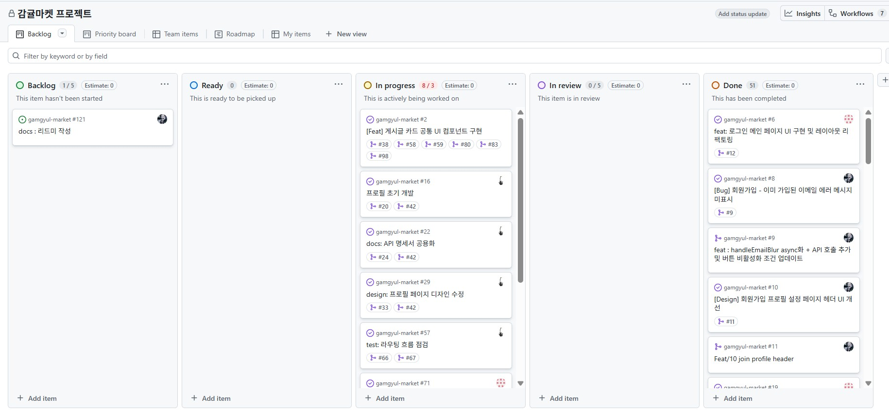

### PR 규칙

- 모든 PR은 `dev` 브랜치를 대상으로 했습니다. (`main` 직접 PR 금지)
- PR 제목 형식: `[type] 요약 (#이슈번호)` 또는 Conventional Commits 형태

```
PR 제목 예시)
[fix] 이미지 업로드 메모리 누수 수정 (#23)
fix(upload): revoke object url on unmount (#23)
```

- PR 본문에 작업 요약 · 변경 사항 · 테스트 방법 · 관련 이슈(`Closes #번호`) 포함
- 셀프 리뷰 후 최소 **1인 approve** 받은 뒤 merge

### GitHub Discussion — 데일리 스크럼

GitHub Discussion을 데일리 회의록으로 활용했습니다.  
매일 작업 내용 · 에러 및 해결 여부 · 작업 스크린샷 · 팀장 회의 코멘트를 기록하여 비동기 상황에서도 팀 전체가 맥락을 파악할 수 있도록 했습니다.


| 항목 | 내용 |
|------|------|
| 작업 현황 | 담당자별 진행 상태 · PR 머지 여부 공유 |
| 스크린샷 | 당일 구현 결과물 이미지 첨부 |
| 이슈 해결 | 기술적 문제 · 원인 · 해결 방법 기록 |
| 팀장 코멘트 | 오전/오후 회의 피드백 정리 |

→ [전체 데일리 회의록 보러가기](GitHub Discussion 링크)

<br>

---

##  개발 규칙

### 파일 확장자 규칙 (.ts vs .tsx)

TypeScript는 JSX 문법이 있는 파일만 `.tsx`로 작성합니다.

| 확장자 | 사용 기준 | 예시 |
|:------:|-----------|------|
| `.ts` | JSX 없음 — API 함수, 유틸, 타입 정의, 훅 (반환값이 JSX가 아닌 경우) | `client.ts`, `useDebounce.ts`, `validateEmail.ts` |
| `.tsx` | `return <JSX />` 가 있는 컴포넌트 | `PostWritePage.tsx`, `Button.tsx` |

> 훅(hook)은 JSX를 반환하지 않으면 `.ts`로 작성합니다.

<br>

---

##  개발 일정 WBS

> **기간**: 2026.02.25 (수) ~ 2026.03.07 (토) · 총 11일  
> **근무일**: 월~토 / **휴무**: 3/1 (일) · 3/2 (삼일절 대체공휴일)

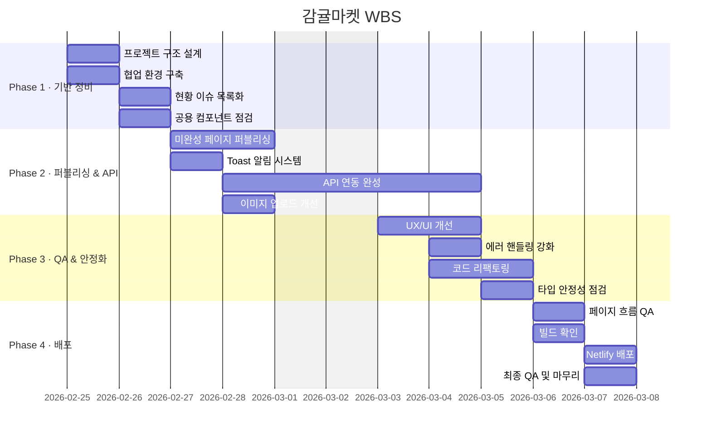
```mermaid
gantt
    title 감귤마켓 WBS
    dateFormat YYYY-MM-DD
    excludes 2026-03-01, 2026-03-02

    section Phase 1 · 기반 정비
    프로젝트 구조 설계       :p1-1, 2026-02-25, 1d
    협업 환경 구축           :p1-2, 2026-02-25, 1d
    현황 이슈 목록화         :p1-3, 2026-02-26, 1d
    공용 컴포넌트 점검       :p1-4, 2026-02-26, 1d

    section Phase 2 · 퍼블리싱 & API
    미완성 페이지 퍼블리싱   :p2-1, 2026-02-27, 2d
    Toast 알림 시스템        :p2-2, 2026-02-27, 1d
    API 연동 완성            :p2-3, 2026-02-28, 3d
    이미지 업로드 개선       :p2-4, 2026-02-28, 1d

    section Phase 3 · QA & 안정화
    UX/UI 개선               :p3-1, 2026-03-03, 2d
    에러 핸들링 강화         :p3-2, 2026-03-04, 1d
    코드 리팩토링            :p3-3, 2026-03-04, 2d
    타입 안정성 점검         :p3-4, 2026-03-05, 1d

    section Phase 4 · 배포
    페이지 흐름 QA           :p4-1, 2026-03-06, 1d
    빌드 확인                :p4-2, 2026-03-06, 1d
    Netlify 배포             :p4-3, 2026-03-07, 1d
    최종 QA 및 마무리        :p4-4, 2026-03-07, 1d
```

### Phase 1. 기반 정비 `2/25 (수) ~ 2/26 (목)`

| No. | 작업 항목 | 세부 내용 | 기간 |
|:---:|-----------|-----------|------|
| 1.1 | 프로젝트 구조 설계 확정 | Feature-based 구조 최종 확인, 폴더 규칙 정리, import alias 통일 | 2/25 |
| 1.2 | 협업 환경 구축 | 브랜치 전략 재확인, PR 템플릿, 코드 리뷰 기준 문서화 | 2/25 |
| 1.3 | 현황 이슈 목록화 | `home/api/index.ts` 코드 혼재, `getTestToken()` 방치, `BASE_URL` 하드코딩 등 이슈 정리 | 2/26 |
| 1.4 | 공용 컴포넌트 분기 점검 | `shared/components` vs `features/*/components` 역할 분리 기준 정립, 중복 컴포넌트(`PostCard`) 통합 여부 결정 | 2/26 |

### Phase 2. 퍼블리싱 & API 연동 `2/27 (금) ~ 3/3 (화)`

> 3/1 (일) 일요일 휴무, 3/2 (월) 삼일절 대체공휴일 제외

| No. | 작업 항목 | 세부 내용 | 기간 |
|:---:|-----------|-----------|------|
| 2.1 | 미완성 페이지 퍼블리싱 | 채팅 목록/채팅방 UI 완성, 빈 상태(Empty State) UI 추가, 스켈레톤/로딩 UI 개선 | 2/27 ~ 2/28 |
| 2.2 | Toast/알림 시스템 구축 | `console.error` 대신 사용자에게 보이는 Toast 컴포넌트 추가 (에러/성공 피드백) | 2/27 |
| 2.3 | API 연동 완성 | Mock 데이터인 채팅 API 연동 검토, 미연동 엔드포인트 확인 및 연결 | 2/28 ~ 3/3 |
| 2.4 | 이미지 업로드 개선 | `URL.createObjectURL` 메모리 누수 수정 (cleanup 추가), 업로드 실패 피드백 추가 | 2/28 |

### Phase 3. QA 및 안정화 `3/3 (화) ~ 3/5 (목)`

| No. | 작업 항목 | 세부 내용 | 기간 |
|:---:|-----------|-----------|------|
| 3.1 | UX/UI 개선 | 폼 유효성 메시지 개선, 빈 피드 안내 화면, 프로필 이미지 fallback 처리 | 3/3 ~ 3/4 |
| 3.2 | 에러 핸들링 강화 | API 실패 시 사용자 피드백 일관성 확보, 401 만료 흐름 점검, 네트워크 에러 처리 | 3/4 |
| 3.3 | 코드 리팩토링 | `home/api/index.ts` 정리, `getTestToken()` 제거, `BASE_URL` constants 통일, 미사용 코드 정리 | 3/4 ~ 3/5 |
| 3.4 | 타입 안정성 점검 | TypeScript `any` 사용 부분 타입 구체화, `shared/types/index.ts` 누락 타입 추가 | 3/5 |

### Phase 4. 흐름 점검 & 배포 `3/6 (금) ~ 3/7 (토)`

| No. | 작업 항목 | 세부 내용 | 기간 |
|:---:|-----------|-----------|------|
| 4.1 | 페이지 흐름 점검 | 로그인 → 회원가입 → 홈 → 프로필 → 게시물 전체 플로우 수동 QA, 라우트 가드 동작 확인 | 3/6 |
| 4.2 | 빌드 확인 | `vite build` TypeScript 에러 0건 확인, 번들 크기 점검, 환경변수 분리 | 3/6 |
| 4.3 | Netlify 배포 | `netlify.toml` 설정, SPA 리다이렉트 (`_redirects` 파일), 환경변수 등록, 도메인 연결 | 3/7 |
| 4.4 | 최종 QA 및 마무리 | 배포 환경에서 전체 기능 검증, 치명적 버그 핫픽스, 릴리즈 태그 | 3/7 |

<br>

---

##  기술 스택

### Frontend

| 기술 | 버전 | 선택 이유 |
|------|:----:|-----------|
| **React** | 18 | 컴포넌트 기반 UI · 팀 전체 공통 경험 보유 |
| **TypeScript** | 5 | 타입 안정성으로 런타임 오류 사전 방지 · 협업 시 코드 가독성 향상 |
| **TailwindCSS** | 3 | 유틸리티 클래스로 빠른 스타일링 · 클래스 충돌 없이 컴포넌트 단위 스타일 관리 |
| **Vite** | 5 | CRA 대비 빠른 빌드 속도 · HMR로 개발 생산성 향상 |
| **react-router-dom** | v6 | SPA 라우팅 표준 · `ProtectedRoute` 구현 용이 |

### 실시간 채팅 — Firebase

| 기술 | 선택 이유 |
|------|-----------|
| **Firestore** | 기존 백엔드 REST API가 실시간 통신을 지원하지 않아, 별도 WebSocket 서버 구축 없이 `onSnapshot` 하나로 실시간 구독을 구현할 수 있는 Firestore를 채택했습니다. 기존 API와 독립적으로 추가할 수 있어 서비스 영향도도 최소화되었습니다. |
| **Anonymous Auth** | MVP 단계에서 Custom Token 방식은 서버 작업이 수반되어 복잡도가 높습니다. 우선 기능 검증에 집중하기 위해 Anonymous Auth를 채택했으며, `auth.ts` 한 곳만 수정하면 Custom Token으로 전환 가능하도록 구조를 분리해두었습니다. |

### 상태관리 라이브러리 미사용 근거

전역 상태의 복잡도가 낮아 Redux · Zustand 등의 외부 라이브러리를 도입하지 않았습니다.  
인증 상태는 **React Context API + localStorage** 조합으로 충분히 관리 가능했으며, 불필요한 의존성을 줄이고 팀 학습 비용을 낮추는 것이 전체 생산성에 유리하다는 팀 결정이었습니다.

### 배포

| 기술 | 내용 |
|------|------|
| **Netlify** | SPA 리다이렉트 `_redirects` · 환경변수 분리 · GitHub 연동 자동 배포 |

<br>

---

##  아키텍처

### 서비스 전체 구조
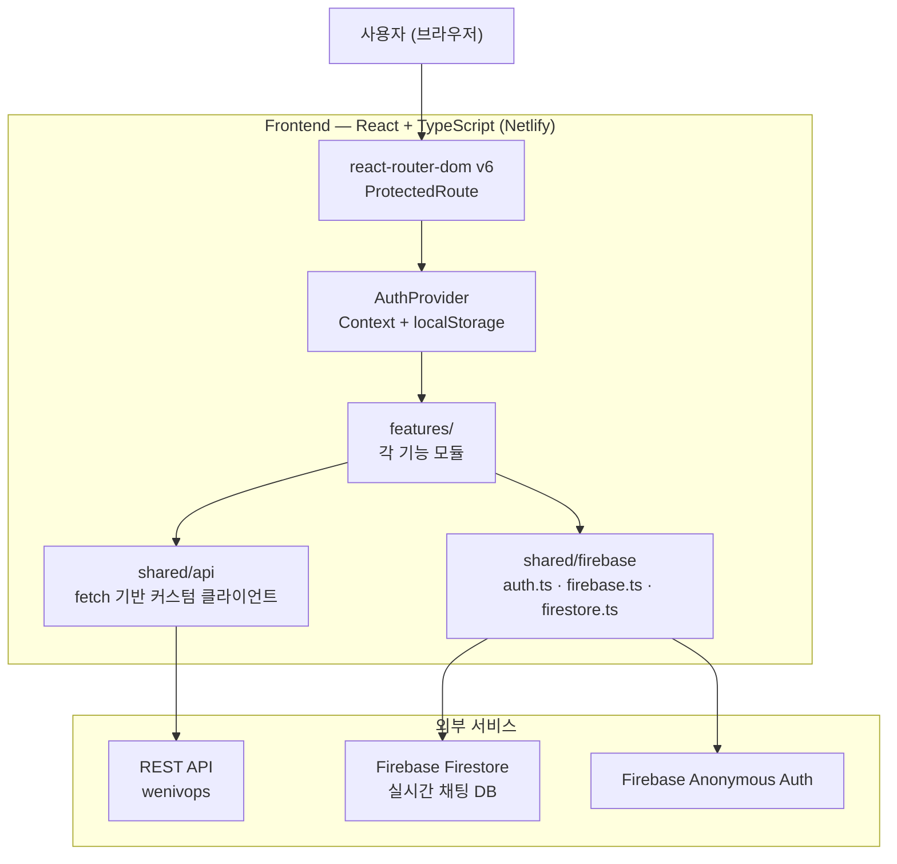
```mermaid
graph TD
    User[" 사용자 (브라우저)"]

    subgraph FE["Frontend — React + TypeScript (Netlify)"]
        Router["react-router-dom v6\nProtectedRoute"]
        Auth["AuthProvider\nContext + localStorage"]
        Features["features/\n각 기능 모듈"]
        SharedAPI["shared/api\nfetch 기반 커스텀 클라이언트"]
        SharedFB["shared/firebase\nauth.ts · firebase.ts · firestore.ts"]
    end

    subgraph External["외부 서비스"]
        REST["REST API\nwenivops"]
        FS["Firebase Firestore\n실시간 채팅 DB"]
        FAAuth["Firebase Anonymous Auth"]
    end

    User --> Router
    Router --> Auth
    Auth --> Features
    Features --> SharedAPI
    Features --> SharedFB
    SharedAPI --> REST
    SharedFB --> FS
    SharedFB --> FAAuth
```

### 실시간 채팅 데이터 흐름
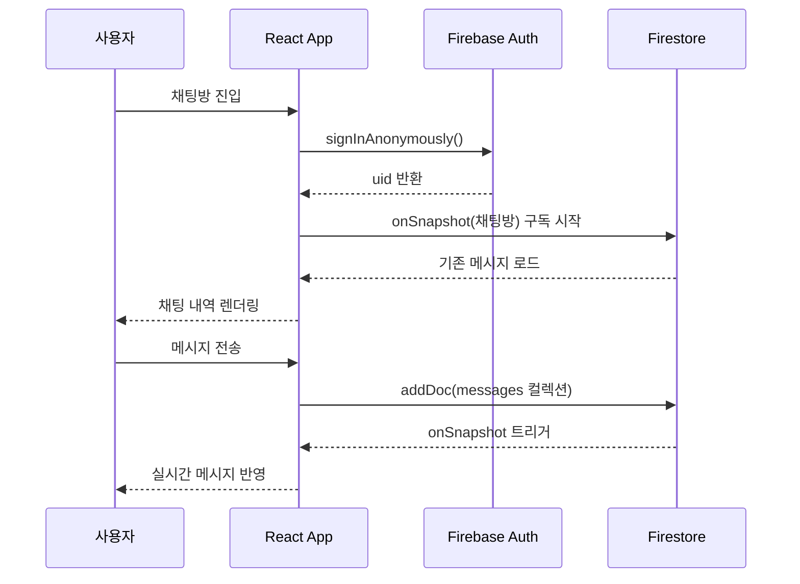
```mermaid
sequenceDiagram
    participant U as 사용자
    participant App as React App
    participant FAAuth as Firebase Auth
    participant FS as Firestore

    U->>App: 채팅방 진입
    App->>FAAuth: signInAnonymously()
    FAAuth-->>App: uid 반환
    App->>FS: onSnapshot(채팅방) 구독 시작
    FS-->>App: 기존 메시지 로드
    App-->>U: 채팅 내역 렌더링

    U->>App: 메시지 전송
    App->>FS: addDoc(messages 컬렉션)
    FS-->>App: onSnapshot 트리거
    App-->>U: 실시간 메시지 반영
```

### 인증 흐름
```mermaid
flowchart LR
    A([페이지 진입]) --> B{ProtectedRoute\n인증 확인}
    B -->|localStorage 토큰 있음| C[페이지 렌더링]
    B -->|토큰 없음| D[/login 리다이렉트]
    D --> E[로그인 성공]
    E --> F[토큰 저장\nContext 업데이트]
    F --> C
```

<br>

---

##  URL 구조

| URL | 페이지 | 인증 필요 | 담당 |
|-----|--------|:---------:|:----:|
| `/` | Splash | X | 한태영 |
| `/login` | 로그인 | X | 강지연 |
| `/404` | 404 | X | 강지연 |
| `/join` | 회원가입 (step 1 / 2) | X | 한태영 |
| `/home` | 홈 피드 | O | 강명주 |
| `/post/upload` | 게시글 작성 | O | 김수진 |
| `/post/:id` | 게시글 상세 | O | 김수진 |
| `/post/:id/edit` | 게시글 수정 | O | 김수진 |
| `/profile/:id` | 프로필 | O | 정준서 |
| `/profile/:id/edit` | 프로필 수정 | O | 정준서 |
| `/profile/:id/followers` | 팔로워 목록 | O | 정준서 |
| `/profile/:id/following` | 팔로잉 목록 | O | 정준서 |
| `/product/upload` | 상품 등록 | O | 정준서 |
| `/product/:id/edit` | 상품 수정 | O | 정준서 |
| `/search` | 사용자 검색 | O | 강명주 |
| `/chat` | 채팅 목록 | O | 한태영 |
| `/chat/:id` | 채팅방 | O | 한태영 |

<br>

---

##  폴더 구조

> Feature 기반 구조로 기능 단위 코드 분리 · 기능 추가 및 유지보수 용이성 확보

```
src/
├── app/
│   ├── layouts/        # AppLayout, TopBar, ProtectedRoute
│   ├── providers/      # AuthProvider (Context + localStorage)
│   ├── router/         # react-router-dom v6 라우터 정의
│   └── styles/         # Tailwind base CSS
│
├── features/           # 기능 단위 모듈 (페이지 + 하위 컴포넌트 + API)
│   ├── login/
│   ├── join/
│   ├── home/
│   ├── profile/
│   ├── product/
│   ├── upload/
│   ├── post/
│   ├── search/
│   └── chat/           # Firebase 실시간 채팅
│
├── shared/             # 여러 feature에서 공유하는 모듈
│   ├── api/            # fetch 기반 커스텀 API 클라이언트
│   ├── components/     # Button, Input, Modal, BottomSheet, TabBar
│   ├── constants/      # 라우트 상수, 정규식, 스토리지 키
│   ├── hooks/          # useDebounce
│   ├── types/          # User, Post, Comment, Product 공통 타입
│   └── utils/          # formatPrice, validateEmail 등
│
└── pages/
    ├── SplashPage.tsx   # 스플래시
    └── NotFoundPage.tsx # 404
```

<br>

---

## 화면 설계

주어진 디자인 시안을 기반으로 구현했습니다.

### 피그마 전체 화면 (미리보기)
[](./docs/피그마%20미리보기.jpg)

→ [Figma 디자인 시안 바로가기](https://www.figma.com/design/rbi8px4O2GrnXN4gK0ZaLv/WENIV_FE_%EC%8B%A4%EC%8A%B5-%EC%98%88%EC%A0%9C?node-id=39-1814&p=f&t=c3scsTPkgaR23ayD-0)

### 실제 구현 화면

**인증**
| Splash | 로그인 | 이메일 로그인 | 회원가입 | 프로필 설정 |
|:------:|:------:|:------------:|:-------:|:-----------:|
| 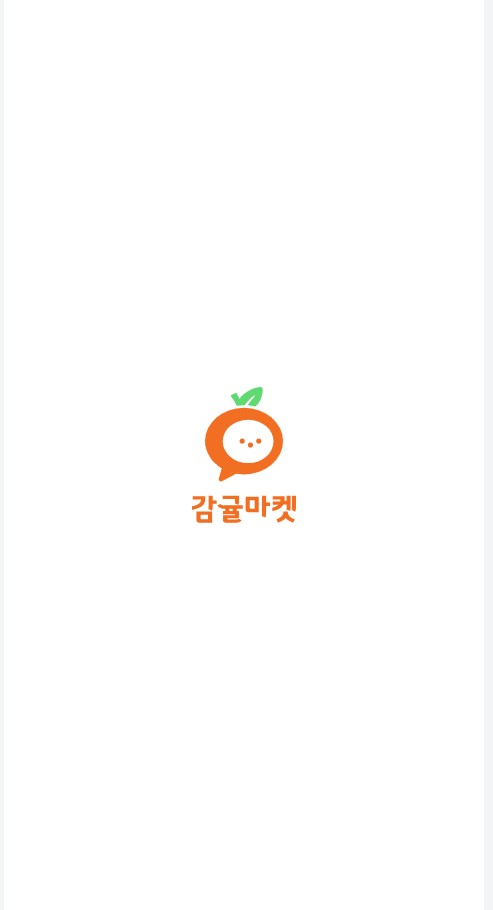 | 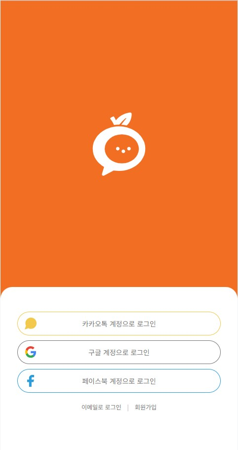 | 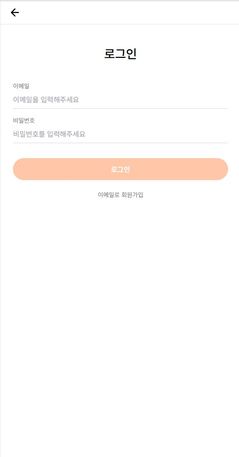 | 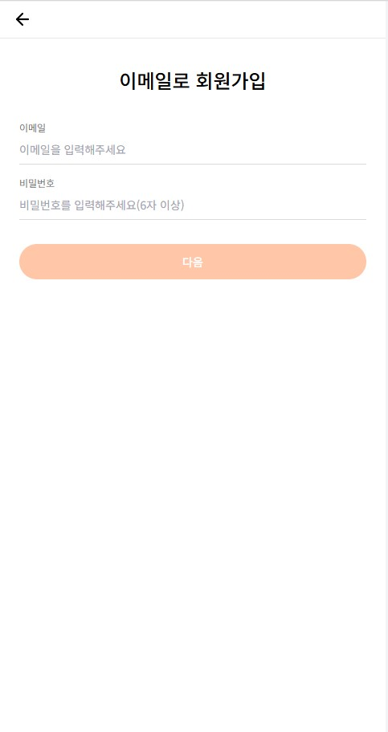 | 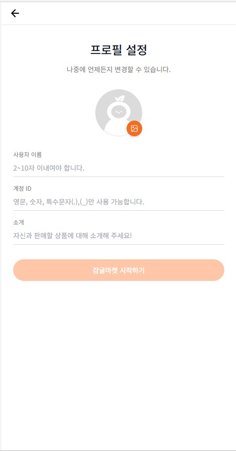 |

**홈 · 검색**
| 홈 (팔로우 O) | 홈 (팔로우 X) | 검색 |
|:------------:|:------------:|:----:|
| 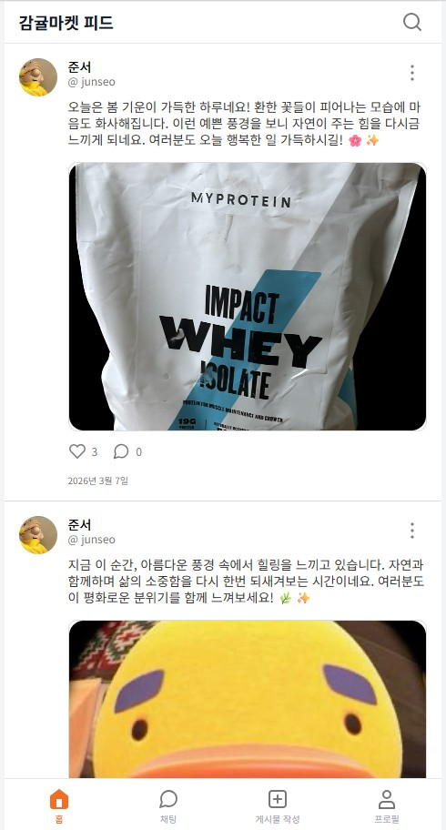 | 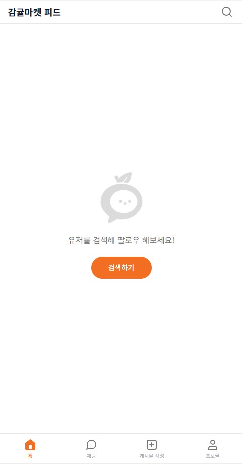 | 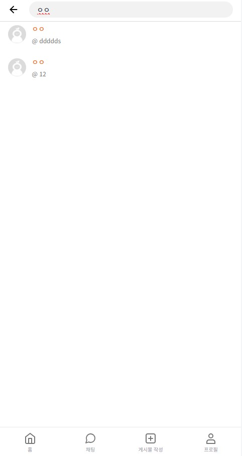 |

**프로필**
| 내 프로필 | 다른 사람 프로필 | 상품 등록 |
|:---------:|:--------------:|:---------:|
| 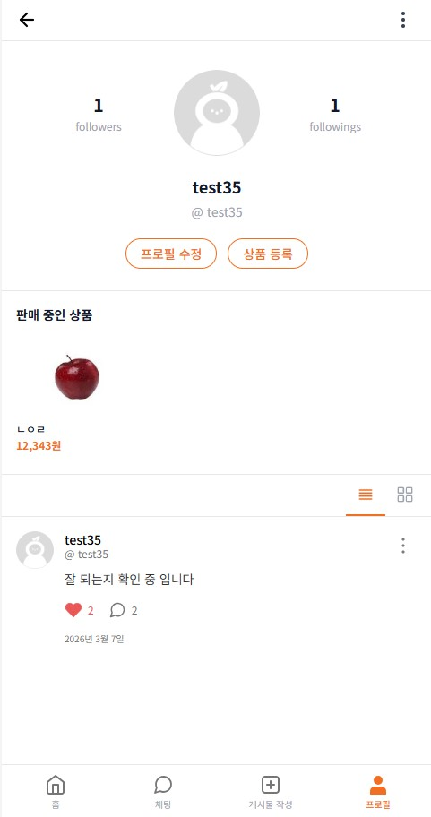 | 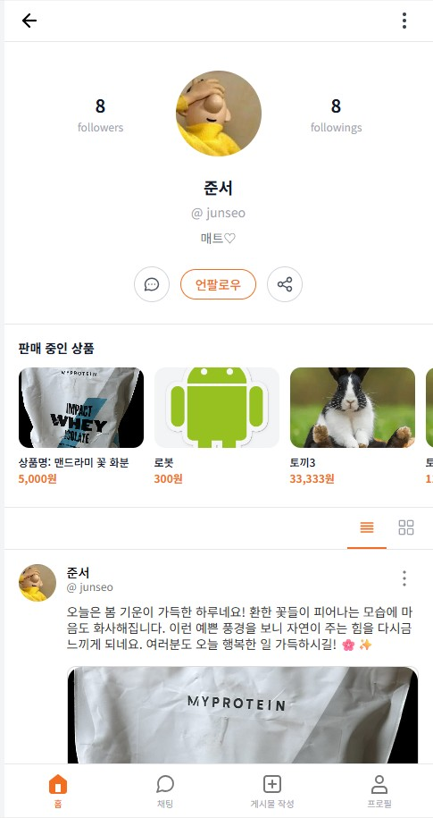 | 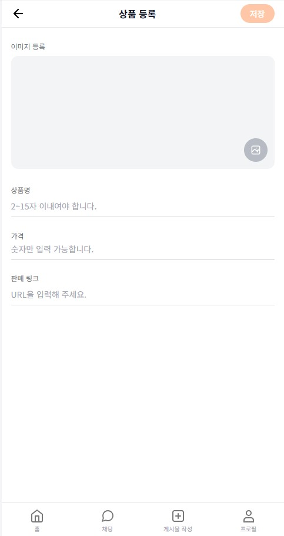 |

**게시글**
| 게시글 상세 | 업로드 |
|:----------:|:------:|
|  |  |

**채팅**
| 채팅 목록 | 채팅방 |
|:---------:|:------:|
| 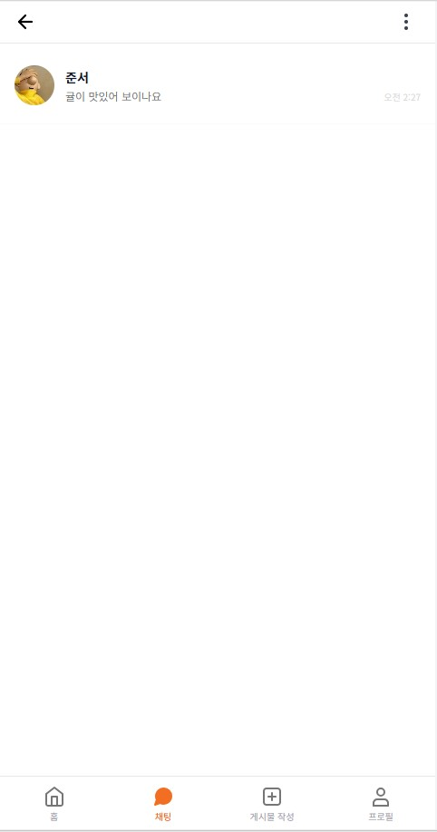 | 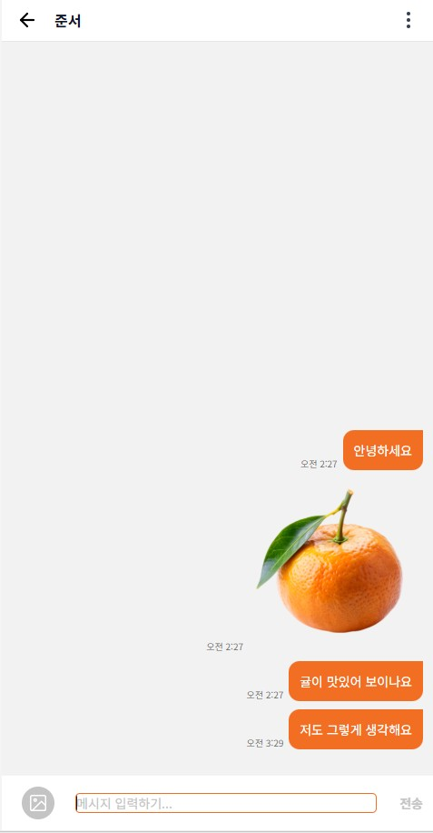 |

**기타**
| 404 |
|:---:|
| 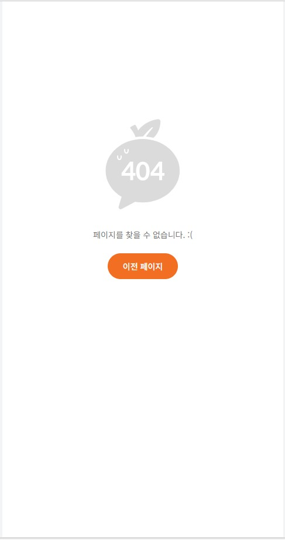 |

<br>

---

##  구현 범위

### 필수 구현

- Splash (로그인 여부에 따라 로그인 화면 또는 홈 피드로 자동 분기)
- 로그인 / 회원가입 / 프로필 설정
- 홈 피드 (팔로우 게시글, 빈 화면)
- 사용자 프로필 (팔로우 버튼 토글 UI · 목록형/앨범형)
- 게시글 작성/상세/댓글
- 상품 등록/수정/삭제
- 바텀시트 + 확인 모달
- 하단 탭바, 404 페이지, 보호 라우트

### 마크업만 (서버 기능 없음)

- SNS 로그인 버튼 (UI만)

<br>

---

##  주요 기능

---

###  Splash

| Splash |
|:------:|
|  |

- 서비스 접속 시 가장 먼저 보이는 초기 화면입니다.
- 스플래시 화면이 잠시 표시된 후 로그인 여부에 따라 자동으로 분기됩니다.
  - 로그인하지 않은 경우 → 로그인 화면으로 이동
  - 이미 로그인된 경우 → 홈 피드로 바로 이동

---

###  로그인

| 메인 로그인 | 이메일 로그인 | 로그인 실패 |
|:----------:|:------------:|:-----------:|
|  |  |  |

- 이메일 기반 로그인 · 한 라우트 내 화면 전환 처리
- 입력값 충족 시 버튼 활성/비활성
- 로그인 실패 시 Toast 에러 메시지 표시
- `ProtectedRoute`를 통한 미인증 사용자 접근 차단

---

###  회원가입

| 회원가입 1단계 | 회원가입 2단계 |
|:-------------:|:-------------:|
|  |  |

- 이메일/비밀번호 포커스 아웃 시 즉시 유효성 검증
- 2단계 회원가입 폼 (동일 라우트 내 step 분기 처리)
- 계정ID 형식 검증 및 중복 확인 API 연동

---

###  홈 피드

| 피드 | 팔로우 없을 때 |
|:----:|:-------------:|
|  |  |

- 팔로우한 사용자의 게시글 목록 최신순 표시
- 팔로우 중인 사용자가 없을 때 **Empty State UI** + "검색하기" 버튼으로 자연스럽게 다음 행동을 유도
- 게시글 카드 공통 UI (프로필 / 이미지 / 내용 / 좋아요 / 댓글 아이콘)

---

###  게시글

| 작성 | 상세 · 좋아요 · 댓글 |
|:----:|:--------------------:|
|  |  |

- 게시글 작성 · 수정 · 삭제 (작성/수정 **동일 컴포넌트 재사용**, prefill 방식으로 기존 데이터 자동 채움)
- 이미지 기본 1장 업로드 (최대 3장)
- 좋아요 토글 · 댓글 작성 및 삭제
- 우측 상단 액션 모달 (수정 / 삭제 / 신고) · 확인 모달

---

###  개인 프로필

| 목록형 | 앨범형 |
|:------:|:------:|
|  |  |

- 사용자 이름 · 계정ID · 소개 · 팔로워/팔로잉 수 · 판매 상품 · 게시글 확인
- 팔로우 버튼 토글 (UI만 · 팔로우 기능 미구현)
- 팔로워/팔로잉 목록 · 게시글 **목록형/앨범형 전환**
- 본인 프로필일 경우: 프로필 수정 버튼 · 상품 등록 버튼 노출
- 상품 등록/수정/삭제 (상품명 2~15자 · 가격 원단위 자동 변환)

---

###  실시간 채팅

| 채팅 목록 | 채팅방 |
|:---------:|:------:|
|  |  |

- Firebase Firestore 기반 **1:1 실시간 채팅**
- `onSnapshot`으로 메시지 실시간 동기화 (서버 폴링 없음 · 별도 백엔드 불필요)
- 채팅 알림 기능

<br>

---

##  코드 품질 관리

### TypeScript 타입 안정성

`any` 사용을 최소화하고, 공통 타입을 `shared/types/index.ts`에 통합하여 관리했습니다.  
타입 정의를 한 곳에서 관리함으로써 협업 시 타입 불일치로 인한 런타임 오류를 사전에 방지했습니다.
```ts
// shared/types/index.ts
export interface Post {
  id: string
  content: string
  image: string
  createdAt: string
  updatedAt: string
  hearted: boolean
  heartCount: number
  commentCount: number
  author: Pick<User, '_id' | 'username' | 'accountname' | 'intro' | 'image'>
}
```

### 공통 API 클라이언트

모든 API 호출을 `shared/api/client.ts` 한 곳에서 관리하여 인증 토큰 주입과 에러 처리를 중앙화했습니다.  
401 응답 시 자동으로 토큰을 제거하고 로그인 페이지로 리다이렉트하는 흐름도 이 계층에서 일괄 처리합니다.
```ts
// shared/api/client.ts
export async function request<T>(
  path: string,
  options: RequestInit & { auth?: boolean; isFormData?: boolean } = {},
): Promise<T> {
  const { auth, isFormData, ...fetchOptions } = options

  const response = await fetch(`${API_BASE_URL}${path}`, {
    ...fetchOptions,
    headers: {
      ...buildHeaders({ auth, isFormData }),
      ...fetchOptions.headers,
    },
  })

  if (response.status === 401 && path !== '/user/login') {
    localStorage.removeItem(TOKEN_KEY)
    window.location.href = '/login'
    throw new ApiError(401, '인증이 만료되었습니다. 다시 로그인해주세요.')
  }

  const data = await response.json().catch(() => ({}))

  if (!response.ok) {
    throw new ApiError(
      response.status,
      data.message ?? `오류가 발생했습니다. (${response.status})`,
    )
  }

  return data as T
}
```

<br>

---

##  트러블슈팅

### 1. 강지연 — Login

**문제**  
공통 `request` 모듈은 401 에러 발생 시 전역에서 `/login`으로 강제 리다이렉트하는 로직이 있었습니다.  
로그인 페이지에서 이 모듈을 그대로 사용하면 로그인 실패 시 페이지가 이동되어 사용자에게 에러 메시지를 표시할 수 없었습니다.

**1차 해결 (임시방편)**  
로그인 페이지에서만 공통 모듈 대신 `fetch`를 직접 호출하도록 분리했습니다.  
응답 객체의 `response.status` · `response.ok`를 기준으로 직접 분기 처리했습니다.
```ts
// 1차 해결 — fetch 직접 호출
const response = await fetch(`${API_BASE_URL}/user/login`, {
  method: 'POST',
  headers: { 'Content-Type': 'application/json' },
  body: JSON.stringify({ user: { email, password } })
})
if (!response.ok || res.message) {
  setLoginError(res.message || '이메일 또는 비밀번호가 일치하지 않습니다.')
  return
}
```

**2차 해결 (근본 해결)**  
`request` 모듈의 401 처리 로직에 `/user/login` 예외 조건을 추가하여 로그인 페이지에서는 리다이렉트가 발생하지 않도록 수정했습니다.  
이후 공통 모듈을 그대로 사용하면서 `ApiError` 타입으로 에러를 분기하여 401/422는 인라인 에러 메시지로, 네트워크 에러는 Toast로 표시하도록 개선했습니다.
```ts
// 2차 해결 — request 모듈 예외 조건 추가
if (response.status === 401 && path !== '/user/login') {
  localStorage.removeItem(TOKEN_KEY)
  window.location.href = '/login'
  throw new ApiError(401, '인증이 만료되었습니다. 다시 로그인해주세요.')
}
```
```ts
// 2차 해결 — ApiError 분기 처리
} catch (err) {
  if (err instanceof ApiError) {
    if (err.status === 422 || err.status === 401) {
      setLoginError(err.message)   // 인라인 에러 메시지
    } else {
      toast.error(err.message)     // Toast 알림
    }
  } else {
    toast.error('네트워크 연결을 확인해주세요')
  }
}
```

---

### 2. [팀원 이름] — 담당 페이지

**문제**

**해결**

```tsx
// 핵심 코드 스니펫
```

---

### 3. [팀원 이름] — 담당 페이지

**문제**

**해결**

```tsx
// 핵심 코드 스니펫
```

---

### 4. [팀원 이름] — 담당 페이지

**문제**

**해결**

```tsx
// 핵심 코드 스니펫
```

<br>

---

##  추후 개선 사항

- Firebase Anonymous Auth → Custom Token 방식 전환 (실사용자 인증 연동)
- 카카오 · 구글 SNS 로그인 연동